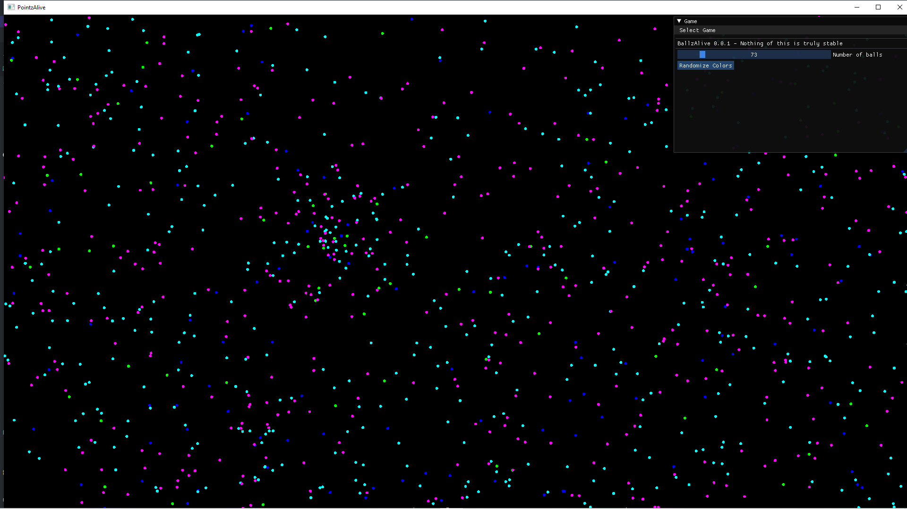

# PointzAlive

A little and simple phisics game, made for fun. <br>
This project is a *Work in progress* (probably it will be for a long time).

<p align="center">
    
</p>


## installation
### Windows

Download a windows build from [Here](https://github.com/Barsay/PointzAlive/releases)


### Build on Linux using CMake (not tested yet)
- Download and install [vcpkg](https://vcpkg.io/en/getting-started.html). Then:

```
    git clone <this project>
    cd PointzAlive
    mkdir build
    cmake -DCMAKE_TOOLCHAIN_FILE=C:\Users\Thoma\dev\vcpkg\scripts\buildsystems\vcpkg.cmake ..
    make
    cd ..
```
When building is complete, to run it:
```
    make run
```

## Thanks
The initial template for this repository was downloaded from Alberto Foti's excellent [Imgui template](https://github.com/XXmorpheusX/ImGuiTemplate)
